# Relatório de Engenharia Web - Base de Dados de Acordãos

## **Introdução**
Este relatório surge no âmbito da Unidade Curricular de Engenharia Web, em que nos foi proposto a concepção de uma aplicação *Web*. 

A proposta de enunciado escolhida pelo grupo foi a criação de uma aplicação *Web* de consulta de acórdãos jurídicos.

### **Contexto**
Na estrutura organizacional do Ministério da Justiça português, estão instituídos vários tribunais, cada um com a sua própria esfera de autonomia. Esses tribunais publicam regularmente um conjunto de acórdãos, constituindo assim um repositório de informações jurídicas de acesso geral.

Embora possam ser observadas algumas semelhanças estruturais nas informações contidas nos acórdãos, é importante destacar que os meios de consulta desses documentos diferem consideravelmente. Esse é o problema que pretendemos minimizar com a implementação desta aplicação.

### **Objectivos**
Na implementação desta aplicação *Web*, pretendemos atingir os seguintes objectivos:

- Criar uma interface *web* que possibilite a navegação em toda a informação disponibilizada.
- Permitir que a aplicação possibilite a criação, edição e remoção de acórdãos.
- Implementar um sistema de pesquisa robusto que permita encontrar facilmente os registos pretendidos.
- Permitir aos utilizadores guardar na sua conta os acórdãos que considerem relevantes para si (os seus favoritos).
- Construir uma taxonomia de termos a partir dos descritores dos acórdãos.

## **Tratamento dos *datasets***
Para o povoamento da base de dados da aplicação, foram fornecidos 14 *datasets* reais provenientes dos diversos tribunais. Estes *datasets* tiveram a necessidade de ser submetidos a um tratamento antes de serem inseridos na base de dados uma vez que estes *datasets* continham diversas inconsistências.

Apresentamos de seguida algumas das tarefas relativas ao tratamento dos dados dos *datasets*:
1. Uniformização de campos escritos de forma diferente, mas que possuem o mesmo significado (por exemplo, "Magistrado" e "Relator" ou "Data do Acordão" e "Data do Acórdão") fazendo com que passem a ter a mesma designação.

2. Eliminação de campos vazios (sem valores).

3. Transformação de datas no formato MM/DD/AAAA para AAAA-MM-DD, para a possibilidade de um mecanismo de ordenação mais simples.

4. Eliminação de caracteres estranhos nos valores do campo "Descritores".
5. Transformação do campo Descritores de certos acórdãos que não eram uma lista numa lista vazia ou numa lista com a string presente.
6. Separação de descritores que se encontravam separados por certos delimitadores (Ex: "HABEAS CORPUS; CONSTITUCIONALIDADE; IMPROCEDENCIA").
7. Remoção de descritores sem sentido (Ex: "00", "(", ";")
8. Normalização de palavras que contêm variações devido ao novo acordo ortográfico (Ex: ACCAO $\rightarrow$ ACAO; DIRECCAO $\rightarrow$ DIRECAO).
9. Remoção de espaços em branco em excesso em certos descritores.
10.  Normalização de descritores através de uma tabela de tradução que indica o descritor a normalizar e o valor com que irá ser substituído (Ex: "ABALROACAO" $\rightarrow$ "ABALROAMENTO", "ABANDONO DE CONJUJE"  $\rightarrow$ "ABANDONO DE CONJUGE").

Devido a certos sinais de pontuação utilizados em grandes descrições textuais, os formatos dos ficheiros JSON continham algumas inconsistências em que partes das descrições textuais foram consideradas como novos campos no formato JSON. Para resolver esta situação implementámos um pequeno programa Python que lia o ficheiro JSON e detetava um nome de campo fora do comum que estivesse seguido de um campo de descrição textual e nos indicava essa situação, fazendo *merge* do conteúdo da descrição textual com os campos inconsistentes detetados.

## **API de dados**
A API de dados da nossa aplicação foi implementada como um serviço isolado que possibilita a comunicação entre o servidor de interface e a base de dados. 

### **Base de dados**
A base de dados da nossa aplicação foi construída num sistema de gestão de bases de dados NoSQL orientado a documentos, o MongoDB.

A base de dados possui três colecções: acórdãos, utilizadores e tribunais.

A colecção `acordaos` é a principal colecção da aplicação. Esta colecção está envolvida na maioria das funcionalidades e interacções que os utilizadores podem fazer, uma vez que é onde estão armazenados todos os acórdãos do sistema.

A colecção `tribunais` é a mais simples e apenas armazena as siglas e os respectivos nomes dos tribunais. Esta colecção é necessária uma vez que os acórdãos possuem o campo ”tribunal” que indica a sigla do tribunal a partir do qual o acórdão foi emitido. Além disso, esta colecção foi também criada com o propósito de permitir uma fácil e eficiente integração de eventuais novos tribunais que possam vir a ser adicionados ao sistema.

A colecção `users` é responsável por armazenar as informações dos utilizadores, desde a informação de autenticação, como também os seus favoritos e o seu histórico de visualização dos acórdãos.

### **Rotas**
A API de dados disponibiliza as seguintes rotas para aceder aos dados dos acórdãos e dos utilizadores.

- `GET /api/:id`: Devolve o acórdão com identificador id.
- `GET /api/acordaos?query`:  Devolve todos os acórdãos que correspondem à *query* enviada. Na URL irá uma *query string* que pode conter alguns campos do acórdão (tribunal, juiz, descritores, etc...). Se não for fornecida uma *query string* nesta rota, a resposta será uma lista com todos os acórdãos presentes na base de dados.
- `GET /api/tribunais`: Devolve todos os tribunais presentes na base de dados.
- `POST /api`: Adiciona um acórdão à base de dados (apenas pode ser feito por um administrador).
- `PUT /api`: Actualiza um acórdão da base de dados (apenas pode ser feito por um administrador).
- `DELETE /api/:idAcordao`: Elimina um acórdão da base de dados (apenas pode ser feito por um administrador).
- `GET /api/users/:id/favourites`: Devolve os acórdãos que o utilizador com o identificador "id" marcou como favoritos (apenas pode ser feito pelo próprio utilizador).
- `POST /api/users/:id/favourites`: Adiciona o acórdão à lista de favoritos do utilizador com o identificador "id" (apenas pode ser feito pelo próprio utilizador).
- `PUT /api/users/:id/favourites`: Actualiza o favorito na lista de favoritos do utilizador com o identificador "id" (apenas pode ser feito pelo próprio utilizador).
- `DELETE /api/users/:id/favourites`: Elimina o acórdão da lista de favoritos do utilizador com o identificador "id" (apenas pode ser feito pelo próprio utilizador).
- `GET /api/users/:id/historico`: Devolve o histórico de visualização de acórdãos do utilizador com o identificador "id" (apenas pode ser feito pelo próprio utilizador).
- `POST /api/users/:id/historico`: Adiciona um acórdão ao histórico de visualização de acórdãos do utilizador com o identificador "id" (apenas pode ser feito pelo próprio utilizador).
- `GET /api/previews/:listaids`: Dada uma lista de identificadores de acórdãos, devolve algumas (não todas) as informações de um acórdão para utilizar em pré-visualizações.
- `GET /api/taxonomia`: Devolve a taxonomia dos descritores em formato JSON.
- `POST /api/tribunais`: Adiciona um novo tribunal na coleção de tribunais (apenas pode ser feito por um administrador).
- `GET /api/users/:idUser/favourite/:idAcordao`: Verifica se um acórdão está nos favoritos de um utilizador.

## **Interface**
O servidor de interface tem como responsabilidade estabelecer a comunicação entre o utilizador e o sistema, ao mesmo tempo que permite a utilização das funcionalidades da aplicação.

### **Rotas**

- `GET /login`: Quando o utilizador entra nesta rota, o servidor irá renderizar a página de *login* para o utilizador se poder autenticar.
- `POST /login`: Quando o utilizador submete os seus dados de *login* para o servidor de interface, este recebe os dados e envia-os ao servidor de autenticação. O servidor de autenticação irá responder com um *token* e esse *token* será enviado pelo servidor de interface ao cliente que o armazenará num *cookie*. 
- `GET /signup`: Quando o utilizador entra nesta rota, o servidor irá renderizar a página de *signup* para o utilizador se poder registar na aplicação.
- `POST /signup`: Quando o utilizador submete os seus dados de registo para o servidor de interface, este recebe os dados e envia-os ao servidor de autenticação. O servidor de autenticação irá registar o utilizador na base de dados e responderá com um *token* para que o utilizador tenha acesso imediato às funcionalidades da aplicação.
- `GET /signupAdmin`: Nesta rota o servidor de interface apresenta ao utilizador (administrador) uma página onde é solicitado o preenchimento dos dados de um novo administrador a ser criado.
- `POST /signupAdmin`: Quando o utilizador submete os dados do novo administrador, o servidor de interface reencaminha-os para o servidor de autenticação que encarregar-se-á de efectuar o registo do novo administrador na base de dados.
- `GET /logout`: Quando o utilizador pretende terminar a sessão, o servidor de interface irá eliminar o *cookie* que armazena o *token* de autenticação e reencaminha o utilizador para a página de *login*.
- `GET /profile`: Nesta rota o servidor de interface solicita ao servidor de autenticação os dados do utilizador que fez a solicitação (o id do utilizador é obtido através do *token*). O servidor de autenticação responde com os dados do utilizador e o servidor de interface renderiza uma página onde é possível visualizar esses dados e alterá-los.
- `GET /home`: Nesta rota o servidor de interface apresenta ao utilizador um formulário que fornece diversas opções de pesquisa de acórdãos. Para além disso, também apresenta os últimos dez acórdãos visitados pelo utilizador.
- `GET /tribunais`: Nesta rota o servidor de interface apresenta ao utilizador uma página com os nomes dos diversos tribunais presentes na base de dados. Os nomes dos tribunais possuem uma ligação que permite consultar todos os acórdãos do respectivo tribunal.
- `GET /acordaos/tribunal/:id_trib`: Nesta rota o servidor apresenta ao utilizador todos os acórdãos emitidos pelo tribunal cujo id é dado por "id_trib".
- `GET /acordaos/add`: Nesta rota o servidor de interface apresenta ao utilizador uma página com um formulário onde o utilizador (apenas o administrador) pode criar um novo acórdão.
- `GET /acordaos/:id`: Nesta rota o servidor de interface apresenta ao utilizador uma página que apresenta a informação completa de um acórdão.
- `GET /search`: Nesta rota o servidor de interface apresenta ao utilizador todos os acórdãos que correspondem aos parâmetros fornecidos na *query string* fornecida.
- `GET /acordaos/edit/:idAcordao`: Nesta rota o servidor de interface apresenta ao utilizador uma página onde é possível editar o acórdão cujo identificador é igual ao valor em "idAcordao".
- `POST /acordaos/edit/:idAcordao`: Nesta rota o servidor de interface recebe os novos dados dos acórdãos e encaminha-os para o servidor da API de dados que encarregar-se-á de fazer a respectiva actualização na base de dados.
- `POST /acordaos/add`: Nesta rota o servidor de interface recebe os dados de um acórdão provenientes de um formulário e encaminha-os para o servidor da API de dados que encarregar-se-á de inserir o novo acórdão na base de dados.
- `POST /acordaos/addFromFile`: Nesta rota o servidor de interface recebe os dados de um acórdão provenientes de um ficheiro JSON e encaminha-os para o servidor da API de dados que encarregar-se-á de inserir o novo acórdão na base de dados.
- `GET /acordaos/delete/:idAcordao`: Nesta rota o servidor de interface utiliza o identificador presente no parâmetro "idAcordao" para fazer uma solicitação à API de dados que encarregar-se-á de eliminar o acórdão.
- `GET /favoritos`: Nesta rota o servidor de interface apresenta ao utilizador algumas informações sobre os acórdãos que selecionou como favoritos bem como a descrição que colocou em cada um.
- `POST /editFavourite`: Nesta rota o servidor de interface envia à API de dados os novos dados relactivos à edição de um favorito (o pedido é feito através de um formulário presente na página de favoritos).
- `GET /deleteFavourite?idAcordao=X`: Nesta rota o servidor de interface envia à API de dados uma solicitação para eliminar o favorito relactivo ao acórdão cujo id se encontra na *query string*.
- `POST /addFavourite`: Nesta rota o servidor de interface envia à API os dados relativos a um favorito criado pelo utilizador para que o favorito seja adicionado à base de dados.
- `POST /editProfile`: Nesta rota o servidor de interface envia ao servidor de autenticação os novos dados de um utilizador (o pedido é feito através do formulário presente na página de perfil do utilizador).
- `GET /taxonomia`: Nesta rota o servidor de interface solicita à API de dados o JSON com a taxonomia e apresenta ao utilizador uma página onde o utilizador pode navegar pela taxonomia.
- `POST /addTribunal`: Nesta rota o servidor de interface envia os dados relativos à adição de um novo tribunal no sistema.
    

## **Servidor de Autenticação**
O servidor de autenticação é responsável pela gestão dos utilizadores, desde da criação de novas contas até à autenticação dos utilizadores na aplicação.

<!-- Aquela frase esquisita que até eliminamos no markdown 
Este servidor utiliza o módulo *passport* para a criação e autenticação dos utilizadores. Este módulo permite também a segurança das contas dos utilizadores na base de dados e da sua autenticação. -->

O servidor de autenticação é também responsável pela criação de um ***token*** (*jsonwebtoken*) sempre que um pedido de registo ou *login* é feito. Esse *token* irá ficar guardado num *cookie* no *browser* do utilizador que será necessário para realizar qualquer pedido ao servidor.

### **Rotas**
- `GET /:id`: Devolve os dados do utilizador (apenas pode ser feito pelo próprio utilizador cujo identificador é igual a "id")
- `POST /register`: Cria uma nova conta de utilizador (não administrador) e devolve um *token* de autenticação para que esta tenha acesso imediato às funcionalidades.
- `POST /registerAdmin`: Cria uma nova conta de utilizador (administrador).
- `POST /login`: Devolve um *token* de autenticação se os campos de autenticação estiverem corretos.

## **Funcionalidades**

### **Registo de conta**
Na página de criação da conta, a aplicação solicita ao utilizador algumas informações para a criação da conta (nome de utilizador, nome, email e palavra-passe).

No momento em que o utilizador confirma a criação da conta, o sistema verifica se já existe algum utilizador com o email mencionado no formulário. Se essa situação ocorrer, a conta não é criada e a aplicação informa o utilizador dessa ocorrência.

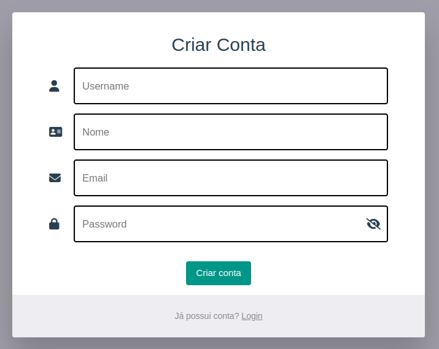

### **Início de sessão**

Na página de *login*, a aplicação solicita ao utilizador o seu *e-mail* e a sua palavra-passe. Se o *e-mail* não existir ou a palavra-passe não coincidir, a aplicação informa o utilizador dessa ocorrência e impede o acesso.

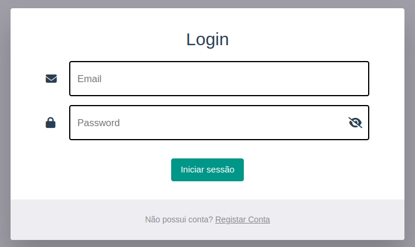

### **Perfil**
Na página de perfil da nossa aplicação o utilizador consegue ver e editar algumas informações relativas à conta onde está autenticado.

O utilizador consegue ver o seu **Username**, **Nome**, **Email**, a **Data de criação da conta** e o seu **Tipo de conta**.

Os campos **Username**, **Nome** e **Email** são editáveis permitindo que o utilizador altere os seus dados. No caso em que o email já esteja em uso ou algum campo esteja vazio, o utilizador é notificado de que não pode fazer essa alteração.

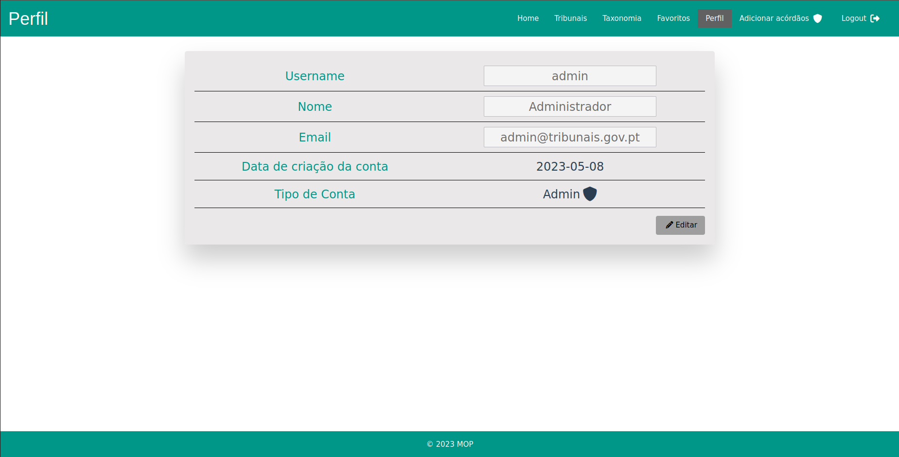

### **Pesquisa**
Na página principal da aplicação, será disponibilizado ao utilizador um formulário de pesquisa (figura abaixo) onde ele pode pesquisar os acórdãos através de diversos campos (Processo, tribunal, Descritores, Juiz e Data do Acordão).
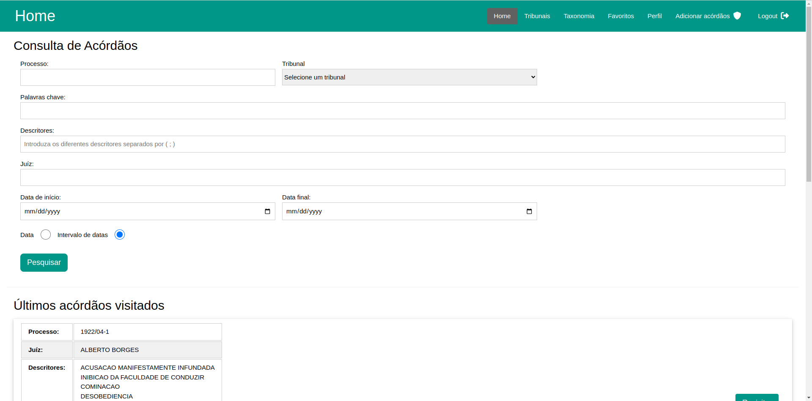

Para além de se poder pesquisar pelos campos dos acórdãos, foi também implementada a opção de procurar acórdãos através de **palavras-chave**. Esta funcionalidade foi implementada através de índices do MongoDB, mais concretamente índices de texto que permitem consultas eficientes de palavras que estejam contidas em campos textuais de uma coleção.

A funcionalidade de pesquisa por palavras-chave para além de permitir a consulta de registos com determinadas palavras, também é capaz de procurar por frases através do uso de aspas ("). Para isso, o utilizador pode escrever `"esta frase inteira"` no campo palavras-chave, que são lhe retornados acórdãos em que a frase `esta frase inteira` apareça. Além disto, podem ser também especificadas palavras que não queremos que apareçam no acórdão através do uso de um hífen, ou seja com esta sintaxe `-negativo afirmativo`, em que são procurados acórdãos em que se encontra a palavra "afirmativo", mas não esteja presente a palavra "negativo".

Após o utilizador especificar os critérios de pesquisa, o utilizador será encaminhado para uma página que apresenta os resultados dessa pesquisa (figura abaixo). 

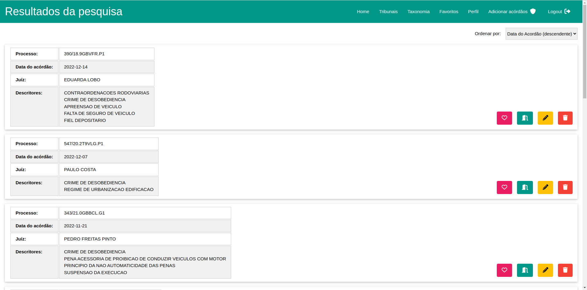

Na página acima, o utilizador pode visitar os acórdãos e marcá-los como favoritos. Se for um administrador, ainda pode eliminá-los do sistema e editá-los.

O utilizador pode, adicionalmente, ordenar os resultados da pesquisa de acordo com um dos seguintes critérios, sendo que os valores apresentados são ordenados por defeito de forma decrescente com base na Data do Acórdão.

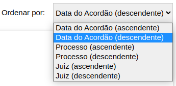

Se o utilizador optar por visitar um acórdão, o sistema reencaminhá-lo-á para uma página com a informação completa do acórdão seleccionado. 

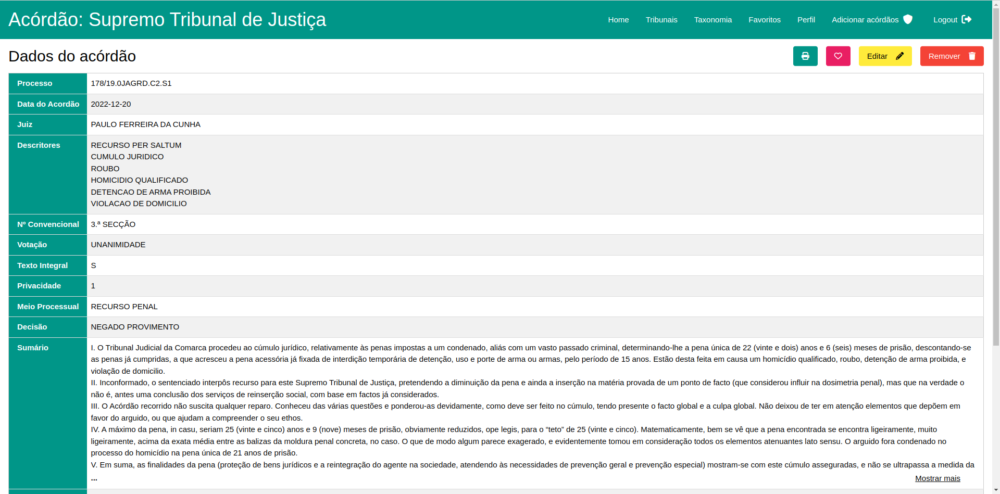

Se o utilizador optar por adicionar o acórdão aos favoritos, a aplicação apresentará uma caixa de diálogo onde solicita ao utilizador uma descrição do favorito.

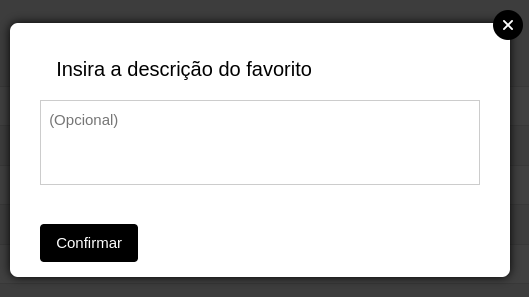

Se o administrador optar por editar um acórdão, este será redirecionado para uma página de edição. Já se optar por remover o acórdão do sistema, o sistema apresentará uma caixa de diálogo onde o administrador tem de confirmar essa decisão.

### **Favoritos**
Na página de favoritos os utilizadores poderão ver todos os acórdãos que marcaram como favoritos. A lista dos favoritos apresenta uma pré-visualização do acórdão, mostrando os campos *Processo*, *Juiz* e *Data do Acórdão*, bem como a descrição inserida pelo utilizador. Para cada favorito da sua lista, o utilizador poderá visitar a página completa do acórdão, editar a sua descrição do acórdão adicionado aos favoritos e remover o acórdão da sua lista de favoritos.
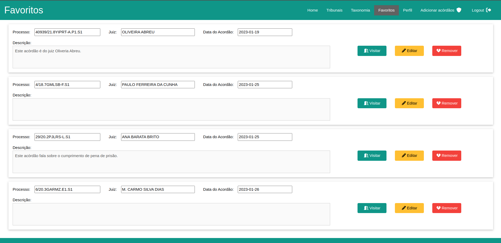

Todos os acórdãos podem ser marcados como favoritos clicando num botão com um ícone de Coração. Essa opção encontra-se em várias páginas de visualização de acórdãos dando assim flexibilidade a esta funcionalidade.

### **Tribunais**
Na página dos tribunais os utilizadores poderão consultar os tribunais presentes na nossa aplicação e poderão consultar os acórdãos referentes a cada tribunal através dessa lista. O administrador tem a opção de adicionar um novo tribunal através do botão "Adicionar um tribunal" onde deverá introduzir o nome e a sigla do novo tribunal.

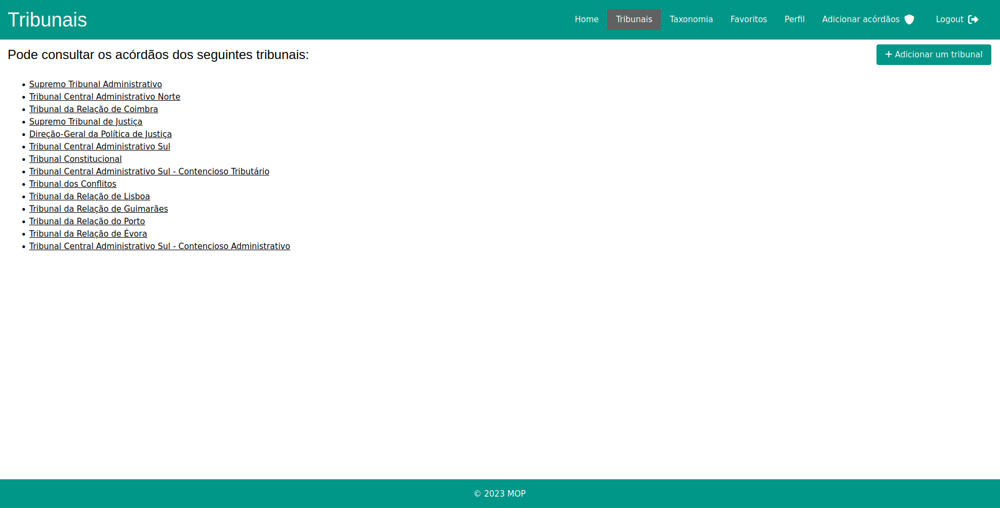

### **Taxonomia**
A taxonomia dos descritores na nossa aplicação foi implementada através da indexação dos descritores segundo a primeira palavra que ocorre em cada um deles. A taxonomia é calculada a partir dos descritores cuja ocorrência na base de dados é igual ou superior a 500.

Na página de navegação da taxonomia, será apresentada ao utilizador a indexação dos diversos descritores. Esta está ordenada alfabeticamente e, ao clicar em cada palavra, o utilizador verá quais os descritores que lhe estão associados, podendo clicar num deles para se dirigir para a página onde poderá visualizar os acórdãos do descritor seleccionado. Para além disso, é disponibilizada uma paginação com todas as letras do alfabeto em que o utilizador pode clicar para se dirigir para os descritores cuja primeira palavra inicia com a letra seleccionada.
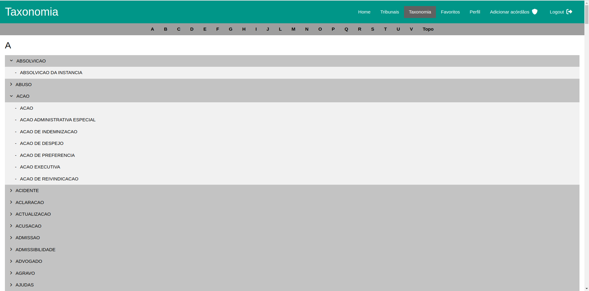

### **Adição de acórdãos**
A funcionalidade de adicionar acórdãos, apenas permitida a administradores, permite submeter acórdãos de duas maneiras diferentes, manualmente ou através de um ficheiro.
A opção é apresentada através de uma *radio box* como apresentado na seguinte figura.

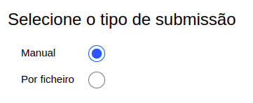

### Adição manual
Para a adição manual, é apresentado ao administrador a seguinte página.

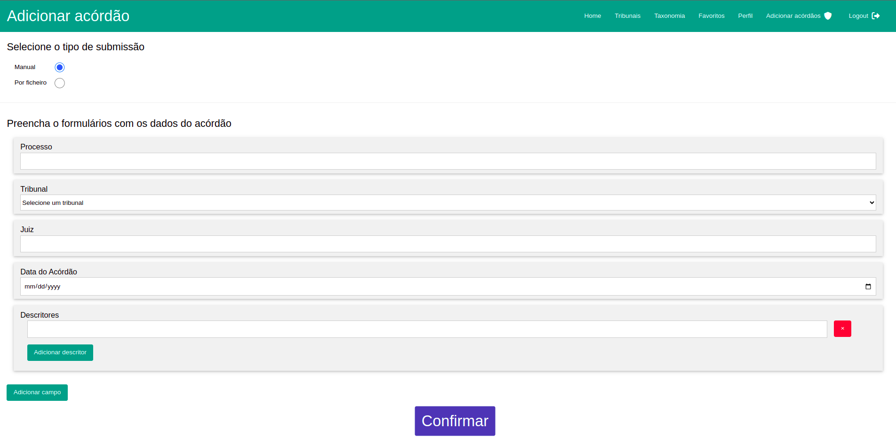

São apresentados cinco campos obrigatórios que o administrador terá de preencher para uma submissão válida de um novo acórdão (Processo, Tribunal, Juiz, Data do Acórdão e Descritores).
Se o administrador desejar adicionar mais do que um descritor ao acórdão, ele tem essa possibilidade através do botão "Adicionar Descritor" que gera uma nova caixa de texto para que o administrador possa preencher, tendo também a possibilidade de apagar o descritor escrito caso o deseje através do botão vermelho à direita do campo de texto.

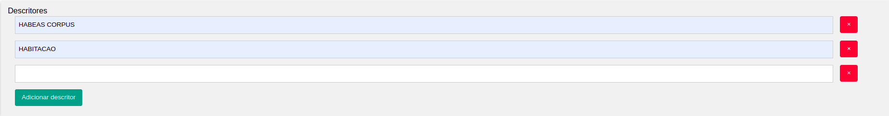

O administrador também tem a liberdade de adicionar mais campos para além dos obrigatórios e para tal foi implementado o seguinte *modal*.

    

        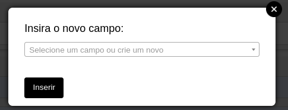
    

    

    

        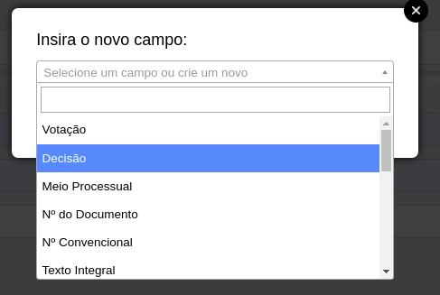
    

Neste *modal* é apresentado ao administrador uma lista dos atributos mais frequentes, podendo simultaneamente atribuir um nome diferente dos recomendados, tendo total liberdade no nome que desejar atribuir ao campo.

### Adição por ficheiro
Para a adição por ficheiro, é apresentada a seguinte página.

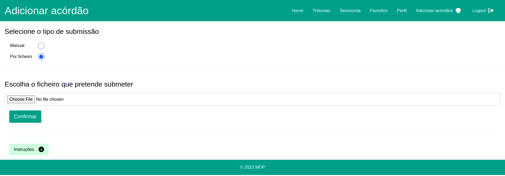
Através desta funcionalidade o administrador pode submeter vários acórdãos de uma só vez através de um ficheiro no formato JSON. 
De modo a instruir melhor o formato geral que o ficheiro deve ter, são apresentadas instruções gerais ao administrador se clicar no botão "Instruções", sendo apresentado o seguinte texto.

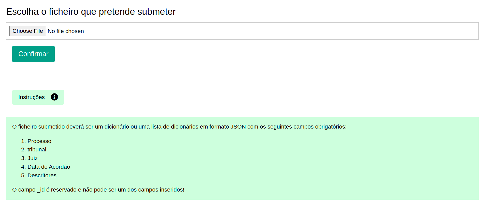

Tanto por ficheiro como por adição manual, o acórdão é submetido a uma validação feita no lado do servidor da API para garantir que os dados não são inválidos e que todos os campos estão corretamente definidos, obedecendo a todas as pré-condições impostas pelo sistema. Entre as restrições estão: o número limite de campos de um registo, número limite de registos (para o caso da submissão do ficheiro), nomes de campos sem sinais de pontuação, etc.

Se a submissão for inválida é apresentada ao administrador uma página que indica o problema e o registo onde ele se encontra.
Na seguinte figura aparece um exemplo de uma submissão de um ficheiro que não contém o campo obrigatório "Data do Acordão".

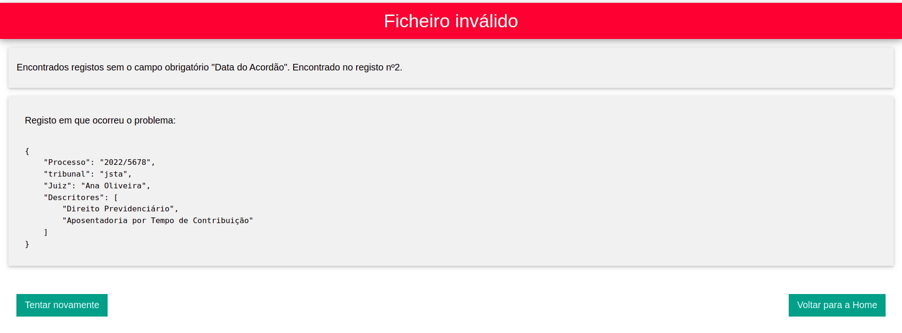

### **Editar Acórdão**
Os administradores têm a capacidade de editar acórdãos já existentes no sistema.

Nesta página os administradores poderão editar qualquer campo do acórdão, com a exceção do seu *ID*, ou adicionar novos campos ao acórdão. Para confirmar as alterações poderá clicar no botão "Confirmar alterações" e as suas alterações serão guardadas no sistema

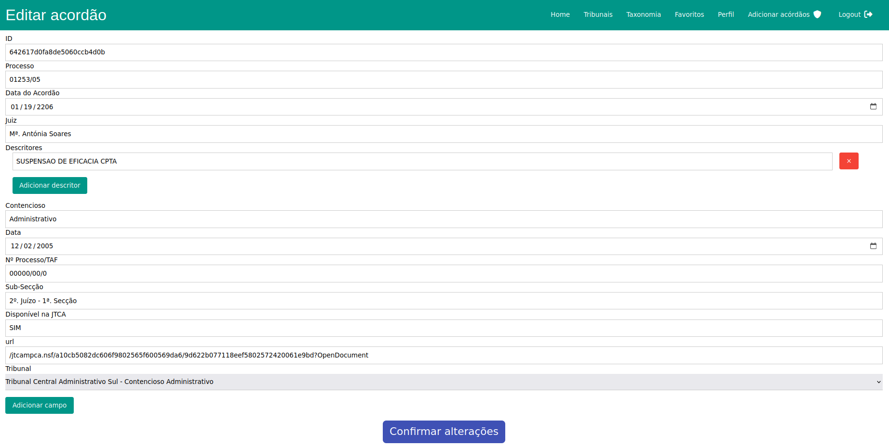

### **Criar um admininistrador**
Os administradores têm a capacidade de criar outros administradores.

Na página de criação da conta de administrador, a aplicação solicita ao utilizador algumas informações para a criação da conta (nome de utilizador, nome, email e palavra-passe).

No momento em que o utilizador confirma a criação da conta, o sistema verifica se já existe algum utilizador com o email mencionado no formulário. Se essa situação ocorrer, a conta não é criada e a aplicação informa o utilizador dessa ocorrência.

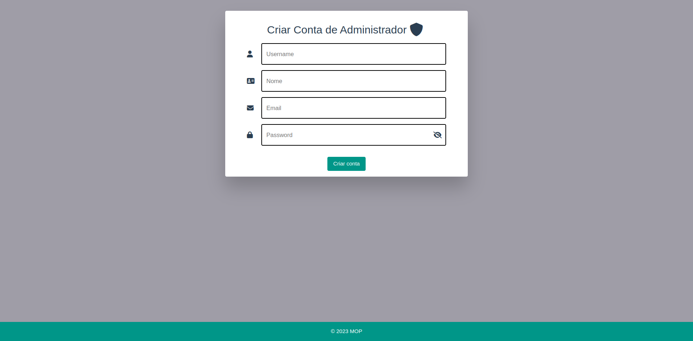
</div

## **Conclusão e Trabalho Futuro**
Dada por concluída a realização do trabalho prático, podemos dizer que este projeto nos ajudou a consolidar o conhecimento obtido através das aulas de Engenharia *Web* e a explorar um pouco mais do desenvolvimento de aplicações *Web*.

O projeto também nos incentivou a resolver problemas reais de gestão de utilizadores e a ter *design* um estético e de fácil compreensão. Implementamos também funcionalidades relativas a qualidade de vida como a paginação na procura dos acórdãos, caixas de confirmação de ações e prevenção de erros. Todas essas funcionalidades foram implementadas com o utilizador final em mente e achamos que fizemos um bom trabalho nesse aspeto.

Como trabalho futuro, há sempre possibilidade para expandir o conjunto de *features* que a aplicação oferece, bem como uma maior dedicação no embelezamento das várias páginas do site. Através do *feedback* de utilizadores concretos da nossa aplicação, seríamos capazes de direcionar o nosso foco para aperfeiçoar funcionalidades de acordo com as suas necessidades específicas, bem como a implementação de novas funcionalidades desejadas pelos nossos utilizadores.

## **Anexos**

### **Anexo 1 - Colocação da aplicação em funcionamento (Docker)**

Na directoria principal do projecto, é possível encontrar o ficheiro `docker-compose` destinado à criação dos *containers* dos quatro servidores da aplicação (Base de Dados, API de Dados, servidor de Autenticação e servidor de Interface), bem como a directoria "mongodata", que consiste num volume utilizado pelo *container* responsável pela execução do servidor MongoDB e que contém a base de dados.

Passos para colocar a aplicação em funcionamento no Docker.
1. Executar o comando `sudo docker-compose up -d --build`.

    Se houver erros na inicialização da aplicação, executar os passos 2 e 3.
2. Executar o comando `sudo docker-compose down`
3. Executar o comando `sudo docker-compose up -d`    
